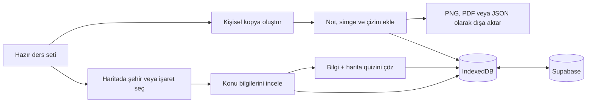

<div align="center">

# 🗺️ KPSS Atlasım

### Coğrafyayı haritada, tarihi neden–sonuç zincirinde çalış.

81 ili seçilebilir gerçek Türkiye haritası, MEB/KPSS odaklı hazır ders setleri,
kişisel notlar, etkileşimli tarih zincirleri ve açıklamalı çalışma oyunları tek
bir uygulamada.

<p>
  
  
  
  
  
  
</p>

**Node.js backend gerektirmez · Hesaplı cihaz senkronizasyonu · Yerel kayıt**

</div>

---

## Proje hakkında

KPSS Atlasım; Türkiye coğrafyasını harita üzerinde, tarihi ise olaylar arasındaki
neden–sonuç ve kronoloji bağlarını kurarak çalışmak için geliştirilen
etkileşimli bir çalışma uygulamasıdır.

Hazır ders setlerini inceleyebilir, şehirlerin üzerine dokunarak sınavlık
bilgilere ulaşabilir veya hazır seti kopyalayıp kendi notlarınla kişisel bir
çalışma haritasına dönüştürebilirsin.

| 81 il | 7 coğrafya seti | 20 tarih olayı | 3 tarih çalışma biçimi |
|:---:|:---:|:---:|:---:|
| Seçilebilir gerçek sınırlar | MEB/KPSS odaklı içerik | Kaynaklı neden–sonuç kartları | Zincir, kronoloji ve sonuç |

## Tarih Zinciri

Tarih bölümü salt not kütüphanesi değildir. Her olay; tarihi, nedeni, sonucu,
ilgili kişi ve devletleri, KPSS ayırıcı bilgisi ve doğrudan MEBİ kaynak
bağlantısıyla birlikte gösterilir.

İlk sürümde iki pilot konu bulunur:

- Osmanlı Dağılma Dönemi: Tanzimat Fermanı'ndan Mondros Ateşkes
  Antlaşması'na uzanan 10 olay.
- Atatürk Dönemi Türk Dış Politikası: Lozan'dan Hatay'ın Türkiye'ye
  katılmasına uzanan 10 olay.

Öğrenci olay zincirini inceleyebilir, kartları kronolojik sıraya koyabilir ve
bir gelişmenin sonucunu diğer olayların sonuçlarından ayırt etmeye çalışabilir.
İncelenen olaylar ile oyun başarısı yerel kayda ve hesaplı kullanımda bulut
snapshot'ına eklenir.

## Hazır ders kütüphanesi

| Ders seti | İşaret | İçerik |
|---|---:|---|
| ⛰️ Dağlar | 31 | Kıvrım, kırık/horst ve volkanik dağlar |
| 🌊 Göller | 18 | Oluşum türleri, doğal göller ve baraj gölleri |
| 🏞️ Akarsular | 17 | Havzalar, önemli kollar ve döküldükleri yerler |
| 🌱 Tarım | 58 | Ürünler, başlıca üretim alanları ve mikroklima örnekleri |
| ⛏️ Maden ve Enerji | 111 | Çıkarım sahaları, enerji kaynakları ve ilişkili tesisler |
| 🚢 Ticaret | 12 | Limanlar, sınır kapıları ve hinterland ilişkileri |
| 🏭 Sanayi | 84 | Fabrikalar, sanayi kolları ve kuruluş yeri nedenleri |

Her hazır set salt okunur açılır. Böylece ders içeriği yanlışlıkla değişmez.
Kişisel not eklemek için **“Kopyala ve kendi notlarını ekle”** seçeneği
kullanılabilir.

## Öne çıkan özellikler

### Etkileşimli Türkiye haritası

- Gerçek il sınırlarına sahip SVG Türkiye haritası
- 81 ilin ayrı ayrı seçilebilmesi
- Hazır setlerde şehir adlarının harita üzerinde gösterilmesi
- İl, not, ürün ve işaret açıklamalarında arama
- Yakınlaştırma ve haritayı ekrana sığdırma araçları
- Kullanılan işaret türlerinden otomatik lejant oluşturma
- Yoğun haritalarda çakışmayı azaltan etiket yerleşimi

### Kişisel çalışma atlası

- Birden fazla bağımsız çalışma haritası oluşturma
- Bir şehre birden fazla bilgi maddesi ekleme
- İl sınırı içinde seçilen noktaya özel işaret bırakma
- Dağ, ova, tarım, göl, akarsu, maden, enerji ve özel simgeler
- Kalem, ok, daire ve metin araçlarıyla harita üzerine çizim yapma
- İşaret katmanlarını ayrı ayrı açıp kapatma
- Haritaları bütün notlarıyla çoğaltma

### Açıklamalı quiz sistemi

- Yedi hazır setin tamamında 8’er bilgi sorusu
- Bilgi soruları ile haritada il bulma sorularını karıştıran quizler
- Her denemede değişen soru ve şık sırası
- Yanlış cevapta doğru cevap ve kısa konu açıklaması
- Doğru cevap oranı, toplam cevap ve en iyi seri takibi

### Dışa aktarma ve yedekleme

- Bütün notlarla birlikte yüksek çözünürlüklü PNG
- A4 yatay PDF/yazdırma düzeni
- Cihazın desteklediği paylaşım menüsü
- JSON yedeği indirme ve yeniden içe aktarma

### Mobil kullanım

Arayüz masaüstü, tablet ve telefon ekranlarına uyumludur. Mobilde:

- Ders ve harita kartları yatay kaydırılabilir.
- Harita ile ayrıntı paneli alt alta yerleşir.
- Araç düğmeleri dokunmatik kullanıma uygun boyuta geçer.
- Quiz seçenekleri ve konu listeleri tek sütuna dönüşür.
- Yoğun etiketler gizlenerek haritanın okunabilirliği korunur.

## Nasıl çalışır?



Uygulama çalışma sırasında verileri tarayıcıdaki **IndexedDB** alanında tutar.
Oturum açıldığında bu yerel kayıtlar kullanıcıya ait tek bir Supabase kaydıyla
senkronize edilir. Böylece bilgisayarda yapılan değişiklikler aynı hesapla
telefondan açıldığında da görünür.

> [!IMPORTANT]
> İlk senkronizasyon tamamlanana kadar veriler yalnızca kullanılan cihazdadır.
> Hesap göstergesindeki “Tüm cihazlarda güncel” mesajı görüldükten sonra çıkış
> yapılmalıdır. JSON yedeği ayrıca bağımsız bir kurtarma seçeneğidir.

## Teknolojiler

| Teknoloji | Kullanım amacı |
|---|---|
| React 19 | Kullanıcı arayüzü ve etkileşimler |
| TypeScript | Tip güvenli uygulama geliştirme |
| Vite 6 | Geliştirme sunucusu ve üretim derlemesi |
| Dexie / IndexedDB | Tarayıcı içinde kalıcı yerel kayıt |
| Supabase Auth / Postgres | Kullanıcı girişi ve cihazlar arası senkronizasyon |
| Lucide React | Arayüz ve harita simgeleri |
| html-to-image | Haritayı yüksek çözünürlüklü görsele dönüştürme |
| turkey-map-react | Türkiye il sınırı verileri |

## Yerel kurulum

Gereksinimler:

- Node.js 20 veya üzeri
- npm

```bash
git clone <depo-adresi>
cd cografya
npm ci
cp .env.example .env.local
npm run dev
```

Uygulama geliştirme ortamında varsayılan olarak
[`http://localhost:5173`](http://localhost:5173) adresinde açılır.

### Supabase kurulumu

1. Supabase projesinde e-posta/şifre girişini etkin bırakın.
2. Projeyi bağlayıp migration dosyasını uygulayın:

```bash
npx supabase link --project-ref <PROJECT_REF>
npx supabase db push --linked
```

3. `.env.local` içine proje URL’sini ve **publishable key** değerini yazın:

```dotenv
VITE_SUPABASE_URL=https://PROJECT_REF.supabase.co
VITE_SUPABASE_PUBLISHABLE_KEY=sb_publishable_...
```

4. Supabase Auth URL ayarlarında hem üretim alan adını hem de geliştirme için
   `http://localhost:5173` adresini izin verilen yönlendirmelere ekleyin.

`secret` veya `service_role` anahtarı hiçbir zaman Vite ortam değişkenine
eklenmemelidir.

Haritalar çevrimdışı kullanım için IndexedDB’de önbelleğe alınır; asıl cihazlar
arası kayıt Supabase’de tutulur. Her bulut yazımı artan bir `revision` değeriyle
karşılaştırılır, eşzamanlı telefon/bilgisayar değişiklikleri üç yönlü
birleştirilir ve önceki JSON sürümü `user_atlas_data_versions` tablosunda
değiştirilemez yedek olarak saklanır. `user_atlas_data` Realtime yayınına
eklendiği için açık cihazlar değişiklikleri anlık alır; bağlantı koparsa
30 saniyelik denetim ve odaklanma kontrolü devreye girer.

## Kullanılabilir komutlar

| Komut | Açıklama |
|---|---|
| `npm run dev` | Vite geliştirme sunucusunu başlatır |
| `npm run build` | TypeScript kontrolüyle üretim derlemesi oluşturur |
| `npm run preview` | Oluşturulan üretim paketini yerelde önizler |

## Sunucuya yükleme

Proje statik olarak yayınlanabilir; Node.js çalışan bir backend gerekmez.
Supabase yönetilen veritabanı ve kimlik doğrulama hizmeti olarak kullanılır.

```bash
npm ci
npm run build
```

Oluşan `dist/` klasörünün **içeriğini** cPanel `public_html`, Nginx web kökü,
Netlify, Vercel veya benzeri bir statik barındırma servisine yükleyin.

| Dağıtım ayarı | Değer |
|---|---|
| Build command | `npm ci && npm run build` |
| Output directory | `dist` |
| Node.js backend | Gerekli değil |
| Ortam değişkenleri | `VITE_SUPABASE_URL`, `VITE_SUPABASE_PUBLISHABLE_KEY` |

> [!NOTE]
> Mevcut üretim paketi alan adının kökünde (`site.com/`) çalışacak şekilde
> hazırlanır. `site.com/cografya/` gibi bir alt klasörde yayınlamak için Vite
> `base` ayarı ve görsel yolları alt dizine göre düzenlenmelidir. Kayıt ve
> paylaşım özelliklerinin eksiksiz çalışması için HTTPS kullanılmalıdır.

## Proje yapısı

```text
coğrafya/
├── public/
│   └── images/sets/       # Hazır ders görselleri
├── src/
│   ├── auth/              # Supabase giriş ve kayıt ekranı
│   ├── cloud/             # IndexedDB ile Supabase senkronizasyonu
│   ├── components/        # Harita, paneller, quiz ve dışa aktarma
│   ├── App.tsx            # Ana uygulama akışı
│   ├── db.ts              # IndexedDB / Dexie veri katmanı
│   ├── markerKinds.ts     # İşaret türleri ve görsel sınıflandırmalar
│   ├── quizBanks.ts       # Hazır setlerin soru bankaları
│   ├── readySets.ts       # MEB/KPSS odaklı hazır ders içerikleri
│   └── styles.css         # Masaüstü ve responsive tasarım
├── ATTRIBUTIONS.md        # Veri, görsel ve paket atıfları
├── supabase/              # RLS korumalı veritabanı migration'ı
├── package.json
└── vite.config.ts
```

## İçerik ve kaynaklar

Hazır çalışma içerikleri hazırlanırken MEBİ Coğrafya konu özetlerindeki
sınıflandırmalar ve sınavda öne çıkan bilgiler esas alınmıştır:

- [Türkiye’de ana yer şekilleri ve dağlar](https://ogmmateryal.eba.gov.tr/kitap/mebi-konu-ozetleri/tyt-cografya/files/basic-html/page76.html)
- [MEB e-KPSS Türkiye’nin platoları haritası](https://orgm.meb.gov.tr/ekpssmebozel/content/magazines/pdf/cografya2.pdf)
- [Türkiye’de göller](https://ogmmateryal.eba.gov.tr/kitap/mebi-konu-ozetleri/tyt-cografya/files/basic-html/page81.html)
- [Türkiye’de akarsular ve havzalar](https://ogmmateryal.eba.gov.tr/kitap/mebi-konu-ozetleri/tyt-cografya/files/basic-html/page83.html)
- [Türkiye’de tarım ürünleri](https://ogmmateryal.eba.gov.tr/kitap/mebi-konu-ozetleri/ayt-cografya/files/basic-html/page28.html)
- [Türkiye’de madencilik ve enerji kaynakları](https://ogmmateryal.eba.gov.tr/kitap/mebi-konu-ozetleri/ayt-cografya/files/basic-html/page34.html)
- [Türkiye’de sanayi](https://ogmmateryal.eba.gov.tr/kitap/mebi-konu-ozetleri/ayt-cografya/files/basic-html/page37.html)
- [Hizmet sektörü ve ulaşım](https://ogmmateryal.eba.gov.tr/kitap/mebi-konu-ozetleri/ayt-cografya/files/basic-html/page80.html)
- [MEBİ Türkiye turizmi ve millî park örnekleri](https://ogmmateryal.eba.gov.tr/kitap/mebi-konu-ozetleri/ayt-cografya/files/basic-html/page86.html)
- [DKMP güncel millî park listesi](https://www.tarimorman.gov.tr/DKMP/Menu/27/Milli-Parklar%3B)

Harita verileri, paket lisansları ve kullanılan görsellerle ilgili ayrıntılar
için [ATTRIBUTIONS.md](./ATTRIBUTIONS.md) dosyasını inceleyin.

---

<div align="center">

**Haritada gör · Bağlantı kur · Tekrar et · Kalıcı öğren**

</div>
