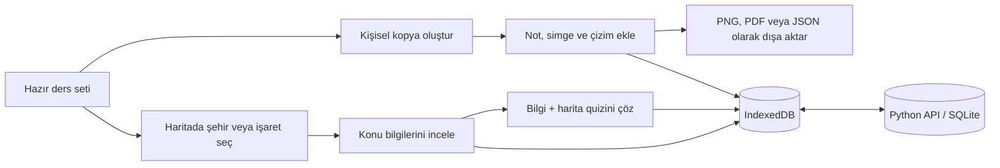

<div align="center">

# 🗺️ KPSS Atlasım

### Coğrafyayı haritada, tarihi neden–sonuç zincirinde çalış.

81 ili seçilebilir gerçek Türkiye haritası, MEB/KPSS odaklı hazır ders setleri,
kişisel notlar, etkileşimli tarih zincirleri ve açıklamalı çalışma oyunları tek
bir uygulamada.

<p>
  
  
  
  
  
  
</p>

**Python 3 + SQLite · Hesaplı cihaz senkronizasyonu · Tarayıcıda yerel kayıt**

</div>

---

## Proje hakkında

KPSS Atlasım; Türkiye coğrafyasını harita üzerinde, tarihi ise olaylar arasındaki
neden–sonuç ve kronoloji bağlarını kurarak çalışmak için geliştirilen
etkileşimli bir çalışma uygulamasıdır.

Hazır ders setlerini inceleyebilir, şehirlerin üzerine dokunarak sınavlık
bilgilere ulaşabilir veya hazır seti kopyalayıp kendi notlarınla kişisel bir
çalışma haritasına dönüştürebilirsin.

| 81 il | 7 coğrafya seti | 20 tarih olayı | 3 tarih çalışma biçimi |
|:---:|:---:|:---:|:---:|
| Seçilebilir gerçek sınırlar | MEB/KPSS odaklı içerik | Kaynaklı neden–sonuç kartları | Zincir, kronoloji ve sonuç |

## Tarih Zinciri

Tarih bölümü salt not kütüphanesi değildir. Her olay; tarihi, nedeni, sonucu,
ilgili kişi ve devletleri, KPSS ayırıcı bilgisi ve doğrudan MEBİ kaynak
bağlantısıyla birlikte gösterilir.

İlk sürümde iki pilot konu bulunur:

- Osmanlı Dağılma Dönemi: Tanzimat Fermanı'ndan Mondros Ateşkes
  Antlaşması'na uzanan 10 olay.
- Atatürk Dönemi Türk Dış Politikası: Lozan'dan Hatay'ın Türkiye'ye
  katılmasına uzanan 10 olay.

Öğrenci olay zincirini inceleyebilir, kartları kronolojik sıraya koyabilir ve
bir gelişmenin sonucunu diğer olayların sonuçlarından ayırt etmeye çalışabilir.
İncelenen olaylar ile oyun başarısı yerel kayda ve hesaplı kullanımda bulut
snapshot'ına eklenir.

## Hazır ders kütüphanesi

| Ders seti | İşaret | İçerik |
|---|---:|---|
| ⛰️ Dağlar | 31 | Kıvrım, kırık/horst ve volkanik dağlar |
| 🌊 Göller | 18 | Oluşum türleri, doğal göller ve baraj gölleri |
| 🏞️ Akarsular | 17 | Havzalar, önemli kollar ve döküldükleri yerler |
| 🌱 Tarım | 58 | Ürünler, başlıca üretim alanları ve mikroklima örnekleri |
| ⛏️ Maden ve Enerji | 111 | Çıkarım sahaları, enerji kaynakları ve ilişkili tesisler |
| 🚢 Ticaret | 12 | Limanlar, sınır kapıları ve hinterland ilişkileri |
| 🏭 Sanayi | 84 | Fabrikalar, sanayi kolları ve kuruluş yeri nedenleri |

Her hazır set salt okunur açılır. Böylece ders içeriği yanlışlıkla değişmez.
Kişisel not eklemek için **“Kopyala ve kendi notlarını ekle”** seçeneği
kullanılabilir.

## Öne çıkan özellikler

### Etkileşimli Türkiye haritası

- Gerçek il sınırlarına sahip SVG Türkiye haritası
- 81 ilin ayrı ayrı seçilebilmesi
- Hazır setlerde şehir adlarının harita üzerinde gösterilmesi
- İl, not, ürün ve işaret açıklamalarında arama
- Yakınlaştırma ve haritayı ekrana sığdırma araçları
- Kullanılan işaret türlerinden otomatik lejant oluşturma
- Yoğun haritalarda çakışmayı azaltan etiket yerleşimi

### Kişisel çalışma atlası

- Birden fazla bağımsız çalışma haritası oluşturma
- Bir şehre birden fazla bilgi maddesi ekleme
- İl sınırı içinde seçilen noktaya özel işaret bırakma
- Dağ, ova, tarım, göl, akarsu, maden, enerji ve özel simgeler
- Kalem, ok, daire ve metin araçlarıyla harita üzerine çizim yapma
- İşaret katmanlarını ayrı ayrı açıp kapatma
- Haritaları bütün notlarıyla çoğaltma

### Açıklamalı quiz sistemi

- Yedi hazır setin tamamında 8’er bilgi sorusu
- Bilgi soruları ile haritada il bulma sorularını karıştıran quizler
- Her denemede değişen soru ve şık sırası
- Yanlış cevapta doğru cevap ve kısa konu açıklaması
- Doğru cevap oranı, toplam cevap ve en iyi seri takibi

### Dışa aktarma ve yedekleme

- Bütün notlarla birlikte yüksek çözünürlüklü PNG
- A4 yatay PDF/yazdırma düzeni
- Cihazın desteklediği paylaşım menüsü
- JSON yedeği indirme ve yeniden içe aktarma

### Mobil kullanım

Arayüz masaüstü, tablet ve telefon ekranlarına uyumludur. Mobilde:

- Ders ve harita kartları yatay kaydırılabilir.
- Harita ile ayrıntı paneli alt alta yerleşir.
- Araç düğmeleri dokunmatik kullanıma uygun boyuta geçer.
- Quiz seçenekleri ve konu listeleri tek sütuna dönüşür.
- Yoğun etiketler gizlenerek haritanın okunabilirliği korunur.

## Nasıl çalışır?



Uygulama çalışma sırasında verileri tarayıcıdaki **IndexedDB** alanında tutar.
Oturum açıldığında bu yerel kayıtlar Python API üzerinden kullanıcıya ait SQLite kaydıyla
senkronize edilir. Böylece bilgisayarda yapılan değişiklikler aynı hesapla
telefondan açıldığında da görünür.

> [!IMPORTANT]
> İlk senkronizasyon tamamlanana kadar veriler yalnızca kullanılan cihazdadır.
> Hesap göstergesindeki “SQLite’a kaydedildi” mesajı görüldükten sonra çıkış
> yapılmalıdır. JSON yedeği ayrıca bağımsız bir kurtarma seçeneğidir.

## Teknolojiler

| Teknoloji | Kullanım amacı |
|---|---|
| React 19 | Kullanıcı arayüzü ve etkileşimler |
| TypeScript | Tip güvenli uygulama geliştirme |
| Vite 6 | Geliştirme sunucusu ve üretim derlemesi |
| Dexie / IndexedDB | Tarayıcı içinde kalıcı yerel kayıt |
| Python / SQLite | Kullanıcı girişi ve cihazlar arası senkronizasyon |
| Lucide React | Arayüz ve harita simgeleri |
| html-to-image | Haritayı yüksek çözünürlüklü görsele dönüştürme |
| turkey-map-react | Türkiye il sınırı verileri |

## Yerel kurulum

Node.js 20+, npm ve Python 3.11+ gerekir. Python sunucusu standart kütüphaneyi kullanır.

```bash
npm ci
cp .env.example .env.local
npm run server
```

İkinci terminalde `npm run dev` çalıştırın. Uygulama `http://localhost:5173`
adresinde açılır; `/api` istekleri port 5005'teki Python sunucusuna gider.
Hesap oluşturun veya mevcut SQLite hesabınızla giriş yapın.

- `VITE_PUBLIC_ACCESS=false`: normal hesaplı kullanım. SQLite kaydı için bu ayar gereklidir.
- Misafir modu: yalnızca bu tarayıcıdaki IndexedDB ve localStorage'a kayıt.
- `VITE_PUBLIC_ACCESS=true`: girişi ve sunucu senkronizasyonunu tamamen atlayan, yalnızca misafir kullanımına yönelik derleme.
- Python `PORT` ve `DB_PATH` değişkenlerini işlem ortamından okur; `.env.local` dosyasını okumaz.
- Geçersiz oturum yeniden giriş gerektirir; bağlantı kesilirse daha önceki cihaz oturumu ve yerel kayıtlar korunur.

## SQLite geçişi ve verilerin korunması

Aktif uygulama Supabase kullanmaz. `supabase/` eski şema ve migration arşividir.
Supabase'deki hesaplar ve yalnızca uzak sunucuda bulunan kayıtlar otomatik olarak
SQLite'a taşınmaz. Eski hesaptaki kayıtları önce dışa aktarın ve SQLite hesabına
kontrollü biçimde içe aktarın; eski veritabanını aktarım doğrulanana kadar saklayın.

Tarayıcıdaki haritalar, notlar, çizimler, çalışma ilerlemesi, soru cevapları ve
kaydedilen sorular hesap snapshot'ında saklanır. Yazımlar `revision` ile
karşılaştırılır; aynı sürümden yapılan ikinci yazım 409 döndürür ve istemci
üç yönlü birleştirerek yeniden dener. Önceki kayıtlar
`user_atlas_data_versions` tablosuna yazılır. Bağlantı geri geldiğinde,
pencere odaklandığında ve 15 saniyelik denetimde eşitleme yeniden denenir.

Hesap/provider değişiminde önceki tarayıcı çalışma alanının kopyası
`cografya-atlasim` IndexedDB veritabanındaki `workspaceBackups` tablosuna,
eski kullanıcı kimliğiyle saklanır. Bu yedek sunucuya aktarılmış sayılmaz ve
tarayıcı verilerini temizlemekle silinir. Eski SQLite SHA-256 şifreleri başarılı
giriş sırasında salt içeren PBKDF2 kaydına yükseltilir; mevcut kullanıcı kimliği
ve atlas kaydı korunur. Şifresiz ortak hesaba giriş kapatılmıştır.
Daha önce oluşturulmuş varsayılan hesabın şifresi otomatik değiştirilmez.
Sunucu üzerinde `python3 server.py --set-password HESAP_EPOSTASI` ile yeni şifre
belirleyip eski oturumları kapatabilirsiniz. Üretimde aynı `DB_PATH` ile çalıştırın.

## Üretime alma

Uygulama artık yalnızca `dist/` yüklenerek çalıştırılan statik bir site değildir.
Python API'nin de çalışması ve SQLite dosyasının kalıcı diskte tutulması gerekir.

```bash
npm ci
npm run build
DB_PATH=/data/cografya.db HOST=0.0.0.0 PORT=5005 python3 server.py
```

Yerelde Python varsayılan olarak yalnızca `127.0.0.1` üzerinde dinler.
Python hem `dist/` dosyalarını hem API'yi sunar. Ters proxy ile HTTPS kullanın.
Dockerfile `/data/cografya.db` kullanır; Coolify'da kalıcı bir volume'u `/data`ya
bağlayın. Nixpacks kullanılıyorsa `DB_PATH` ortam değişkenini kalıcı volume'daki
konuma ayarlayın. Eski `cografya.db` dosyası varsa sunucu duruyorken volume'a
kopyalayın; boş bir dosyayla değiştirmeyin. Kalıcı volume olmadan yeniden dağıtım
hesap ve atlas kayıtlarını kaybettirebilir. SQLite dosyası için ayrıca düzenli
SQLite backup yedeği alın; sürüm tablosu disk yedeğinin yerini tutmaz.

Telefon ve bilgisayarın aynı kayıtları görmesi için ikisi de aynı sunucu adresi
ve hesapla bağlanmalıdır. Telefonda ayrı bir localhost veritabanı paylaşılmaz.

| Komut | Açıklama |
|---|---|
| `npm run dev` | Vite geliştirme sunucusu |
| `npm run server` | Python SQLite API |
| `npm run build` | TypeScript kontrolü ve üretim paketi |
| `npm run preview` | Derlenmiş arayüzü önizler; API ayrıca çalışmalıdır |

## Proje yapısı

```text
coğrafya/
├── public/
│   └── images/sets/       # Hazır ders görselleri
├── src/
│   ├── auth/              # SQLite hesap giriş ve kayıt ekranı
│   ├── cloud/             # IndexedDB ile SQLite senkronizasyonu
│   ├── components/        # Harita, paneller, quiz ve dışa aktarma
│   ├── App.tsx            # Ana uygulama akışı
│   ├── db.ts              # IndexedDB / Dexie veri katmanı
│   ├── markerKinds.ts     # İşaret türleri ve görsel sınıflandırmalar
│   ├── quizBanks.ts       # Hazır setlerin soru bankaları
│   ├── readySets.ts       # MEB/KPSS odaklı hazır ders içerikleri
│   └── styles.css         # Masaüstü ve responsive tasarım
├── ATTRIBUTIONS.md        # Veri, görsel ve paket atıfları
├── supabase/              # Eski Supabase şema arşivi
├── package.json
└── vite.config.ts
```

## İçerik ve kaynaklar

Hazır çalışma içerikleri hazırlanırken MEBİ Coğrafya konu özetlerindeki
sınıflandırmalar ve sınavda öne çıkan bilgiler esas alınmıştır:

- [Türkiye’de ana yer şekilleri ve dağlar](https://ogmmateryal.eba.gov.tr/kitap/mebi-konu-ozetleri/tyt-cografya/files/basic-html/page76.html)
- [MEB e-KPSS Türkiye’nin platoları haritası](https://orgm.meb.gov.tr/ekpssmebozel/content/magazines/pdf/cografya2.pdf)
- [Türkiye’de göller](https://ogmmateryal.eba.gov.tr/kitap/mebi-konu-ozetleri/tyt-cografya/files/basic-html/page81.html)
- [Türkiye’de akarsular ve havzalar](https://ogmmateryal.eba.gov.tr/kitap/mebi-konu-ozetleri/tyt-cografya/files/basic-html/page83.html)
- [Türkiye’de tarım ürünleri](https://ogmmateryal.eba.gov.tr/kitap/mebi-konu-ozetleri/ayt-cografya/files/basic-html/page28.html)
- [Türkiye’de madencilik ve enerji kaynakları](https://ogmmateryal.eba.gov.tr/kitap/mebi-konu-ozetleri/ayt-cografya/files/basic-html/page34.html)
- [Türkiye’de sanayi](https://ogmmateryal.eba.gov.tr/kitap/mebi-konu-ozetleri/ayt-cografya/files/basic-html/page37.html)
- [Hizmet sektörü ve ulaşım](https://ogmmateryal.eba.gov.tr/kitap/mebi-konu-ozetleri/ayt-cografya/files/basic-html/page80.html)
- [MEBİ Türkiye turizmi ve millî park örnekleri](https://ogmmateryal.eba.gov.tr/kitap/mebi-konu-ozetleri/ayt-cografya/files/basic-html/page86.html)
- [DKMP güncel millî park listesi](https://www.tarimorman.gov.tr/DKMP/Menu/27/Milli-Parklar%3B)

Harita verileri, paket lisansları ve kullanılan görsellerle ilgili ayrıntılar
için [ATTRIBUTIONS.md](./ATTRIBUTIONS.md) dosyasını inceleyin.

---

<div align="center">

**Haritada gör · Bağlantı kur · Tekrar et · Kalıcı öğren**

</div>
